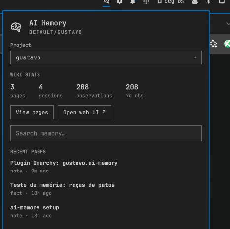

# AI Memory — Omarchy bar panel

Desktop companion for [ai-memory](https://github.com/akitaonrails/ai-memory).
Brings the read-only wiki to the Omarchy shell: pending handoff, session
stats, full page listing, FTS5 search, and in-panel markdown rendering —
no browser needed.



`kinds: ["bar-widget"]` · manifest-backed · hot-reloads on save

## Quick install

Download, verify the published SHA-256, then run — no pipe-to-shell:

```bash
curl -fsSL -o /tmp/omarchy-ai-memory-install.sh   https://raw.githubusercontent.com/luizgustavosaraiva/omarchy-ai-memory/v1.1.2/install.sh
echo "ebdb3057bbe09b81e9b4e16ffe7b33640947bc8ac3af5a08a6bb1e68137fc717  /tmp/omarchy-ai-memory-install.sh" | sha256sum -c -
bash /tmp/omarchy-ai-memory-install.sh
```

The digest above matches `checksums.txt` in this repository and the
installer checks out the exact pinned release commit. To update, re-run
these commands (they are refreshed at every release).

## Install

```bash
git clone https://github.com/luizgustavosaraiva/omarchy-ai-memory \
  ~/.config/omarchy/plugins/luizgustavosaraiva.ai-memory
omarchy-shell shell rescanPlugins
omarchy plugin enable luizgustavosaraiva.ai-memory
omarchy bar move luizgustavosaraiva.ai-memory --section right
```

Requires a running ai-memory server (v2.x) — local or LAN:

```bash
ai-memory serve --transport http --bind 127.0.0.1:49374 --enable-web
```

On Arch, `omarchy pkg aur add ai-memory-bin` installs the server plus a
user systemd unit (`systemctl --user enable --now ai-memory.service`).

## What you get

- **Bar icon** — lights up when the current project has an open handoff
  waiting for the next session. Left-click toggles the panel, middle-click
  refreshes, right-click deep-links the web UI.
- **Panel**
  - Status hero (server / workspace / project).
  - Offline card with the exact `ai-memory serve` command when unreachable.
  - **Project picker** — searchable dropdown, scales to any number of projects.
  - **Open handoff card**: agent, age, summary, open questions, next steps.
  - **Wiki stats**: pages, sessions, observations, 7-day activity.
  - **View pages** — full page list, newest first (capped at 100 rows;
    anything older is reachable via search, which hits the whole store).
  - **Search** — FTS5, debounced, with clickable results.
  - Clicking any page renders its markdown in-panel (`Text.MarkdownText`).

The whole panel scrolls vertically, so long listings behave.

## Configuration

Inline config on the bar entry in `~/.config/omarchy/shell.json`:

```json
{ "id": "luizgustavosaraiva.ai-memory", "serverUrl": "http://homelab:49374", "token": "", "pollIntervalSec": 30 }
```

| Key | Default | Meaning |
|---|---|---|
| `serverUrl` | `http://127.0.0.1:49374` | Base URL of the ai-memory server |
| `token` | *(empty)* | `AI_MEMORY_AUTH_TOKEN` or `aim_` API key when the server has auth enabled |
| `pollIntervalSec` | `30` | Polling interval (min 5) |
| `preferredWorkspace` | `default` | Workspace to browse |
| `preferredProject` | *(empty)* | Pin a project; empty follows the most recently updated one |

The same keys exist in the manifest `schema`, so they surface in plugin
settings UIs.

## Files

- `manifest.json` — plugin contract (`bar-widget`, defaults, settings schema)
- `Main.qml` — `/api/v1` client (workspaces → projects → overview → pages → search → page)
- `Panel.qml` — bar button + popup panel UI

## Notes for packagers

- The plugin id is namespaced (`luizgustavosaraiva.ai-memory`); rename the directory,
  the `id`, and the shell.json entry together if you fork it.
- All UI strings are English; the read-only `/api/v1` surface means the
  panel can never mutate your wiki.
- v2.2.x of ai-memory drifts from `docs/frontend-api.md`: list endpoints
  (`/projects`, `/search`, `/recent`, `/pages`) return bare JSON arrays, and
  the page read returns `body_markdown` instead of `body` — `Main.qml`
  tolerates both shapes.
